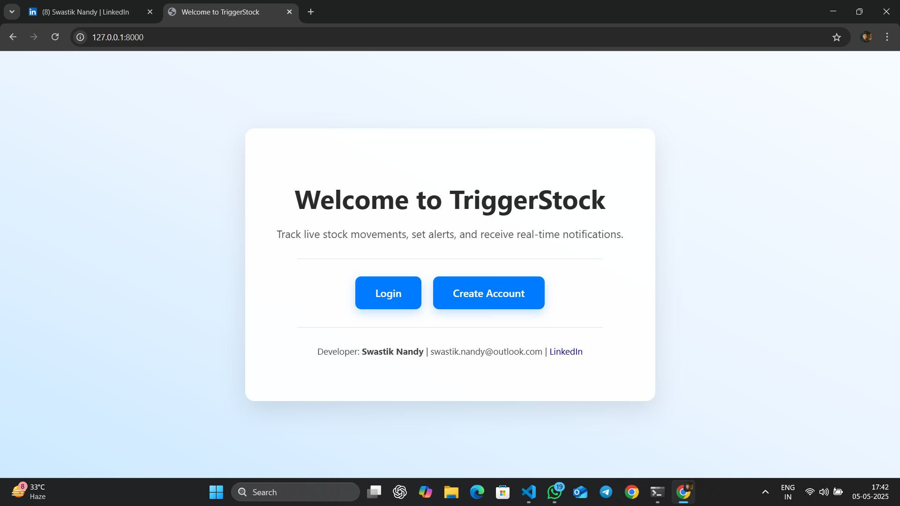
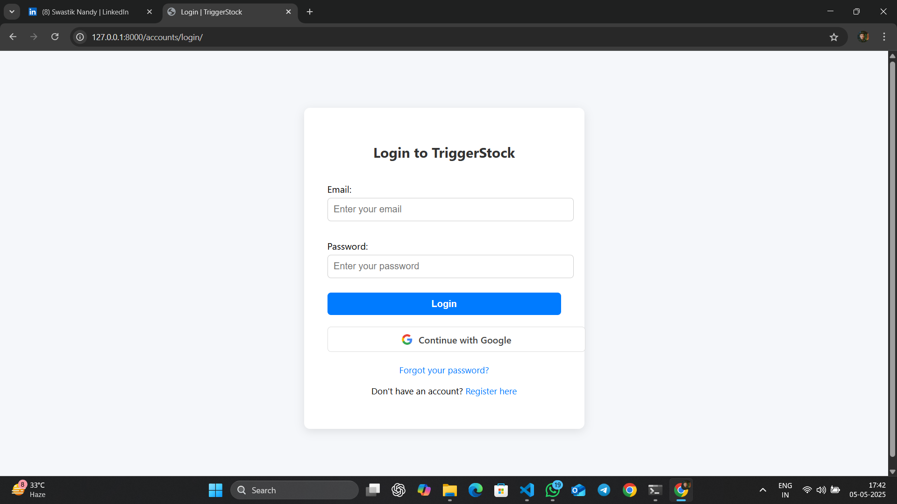
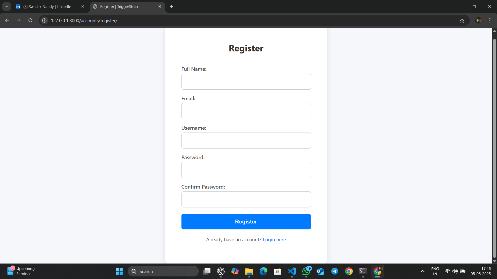
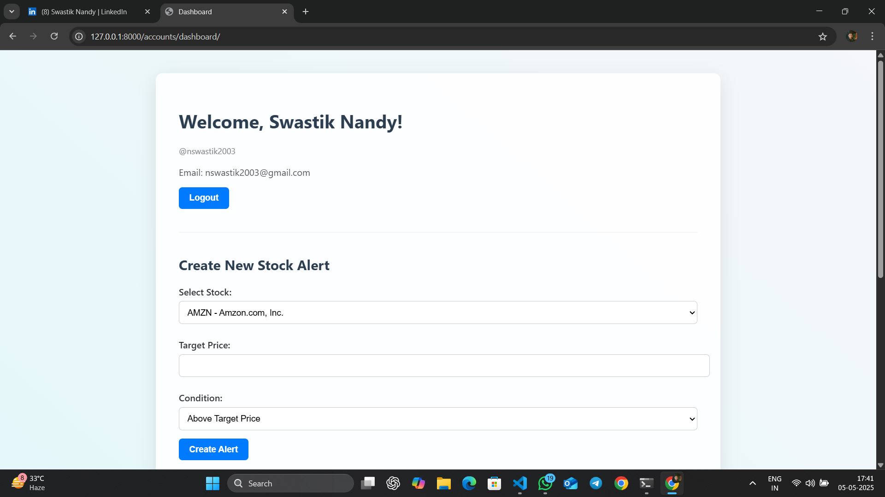
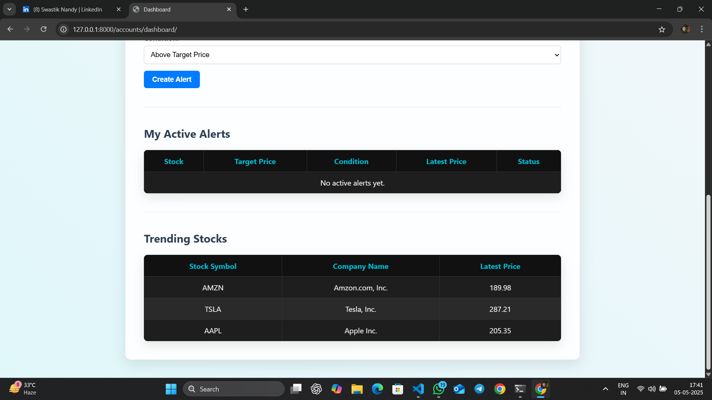
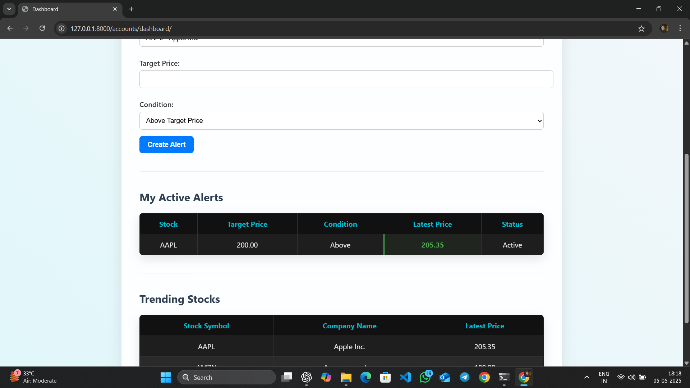
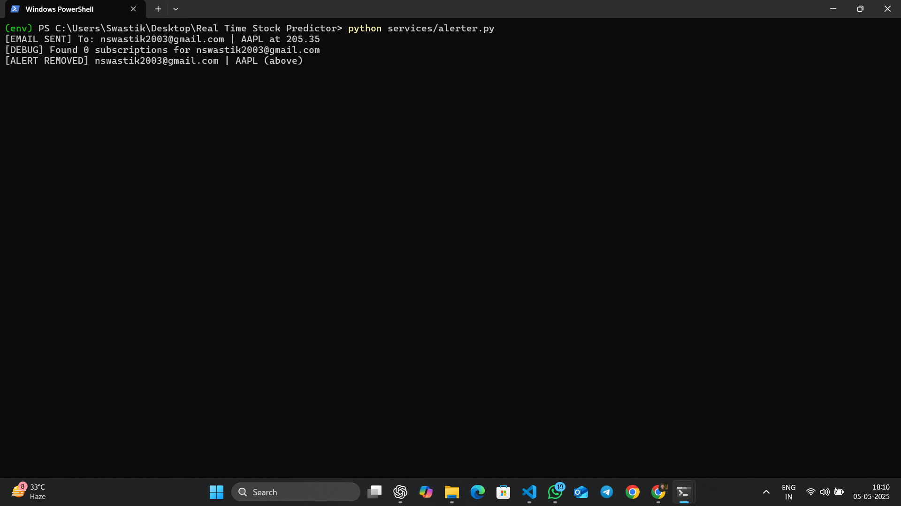
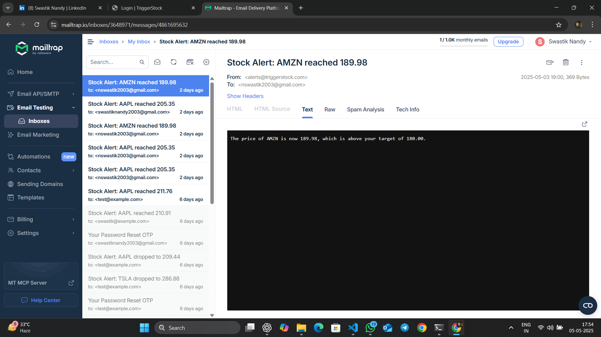
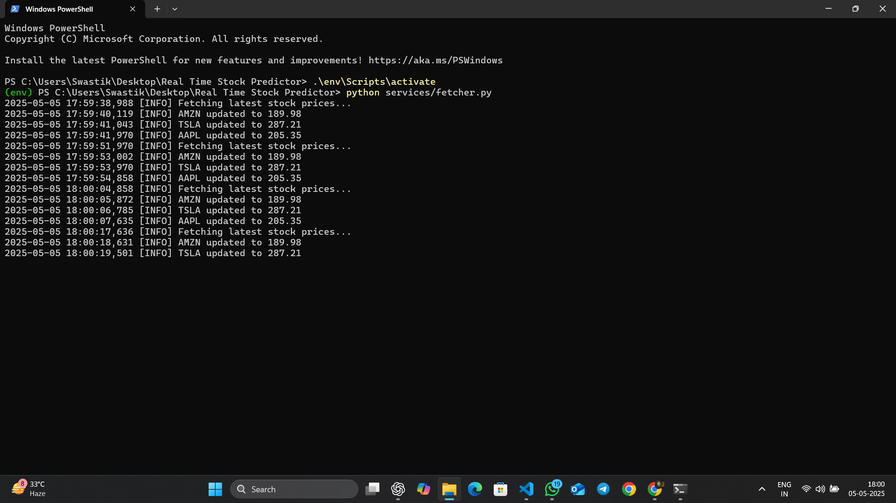
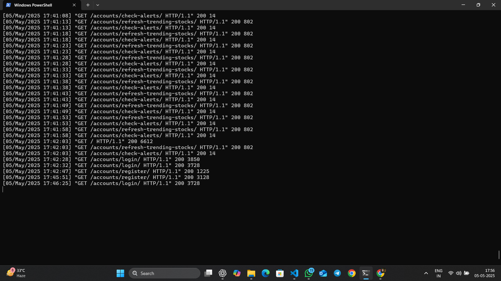

# 📈 Real-Time Stock Alerting System

A real-time stock alerting system built using Django and PostgreSQL. This platform lets users monitor live stock prices, set custom alerts, and receive instant notifications via email and web push. Features include Google OAuth login, OTP-based password reset, and a modular backend for scalability.

---

## 🚀 Features

| Feature             | Description                                                                          |
|---------------------|--------------------------------------------------------------------------------------|
| 🔐 Auth             | Secure login via email/password and Google OAuth2                                   |
| 🔑 OTP Verification | Email-based OTP for registration and password resets                                |
| 📊 Stock Tracking   | Real-time stock price fetching using the Finnhub API                                 |
| 🛎️ Alerts          | Set custom alerts like “AAPL > 150”, get notified when triggered                     |
| 📬 Notifications    | Email and web push alerts when user-defined conditions are met                       |
| ⚙️ Services         | Background scripts for live data fetch & alert inspection                            |
| 🧾 Admin Panel      | Full Django admin support for all models                                             |

---

## 🧠 Tech Stack

| Layer          | Tools & Technologies                     |
|----------------|-------------------------------------------|
| Backend        | Django 4.x (Python)                      |
| Database       | PostgreSQL                               |
| Frontend       | HTML, CSS, JavaScript                    |
| Auth           | Email/Password, Google OAuth2            |
| API            | Finnhub API for stock prices             |
| Notifications  | Mailtrap SMTP + Web Push Notifications   |
| Hosting        | Coming soon: Docker + CI/CD              |

---

## 📁 Project Modules

| Module         | Responsibility                                        |
|----------------|--------------------------------------------------------|
| `accounts`     | Handles user auth, OTP, Google login                   |
| `stocks`       | Models + logic for fetching and storing stock data     |
| `alerts`       | Alert creation, checking, and user-specific logic      |
| `notifications`| Web push subscription and delivery                     |
| `services`     | Scripts: `fetcher.py`, `alerter.py`                    |
| `templates`    | Django templates (dashboard, login, register, etc.)    |
| `static`       | JS (notifier.js), styles, and frontend assets          |

---

## 🔌 API Endpoints

### 🔐 User Authentication

| Endpoint                             | Method | Description                                        |
|--------------------------------------|--------|----------------------------------------------------|
| `/accounts/register/`                | POST   | Register new user with email and password          |
| `/accounts/login/`                   | POST   | User login using email or username                 |
| `/accounts/logout/`                  | POST   | Logout the user                                    |
| `/accounts/password-reset/`          | POST   | Request OTP for password reset                     |
| `/accounts/password-reset/confirm/`  | POST   | Confirm new password using OTP                     |
| `/accounts/google/login/`            | GET    | Redirect to Google for OAuth2 login                |
| `/accounts/google/callback/`         | GET    | Google OAuth2 login callback                       |

---

### 📊 Stock Management

| Endpoint                 | Method | Description                           |
|--------------------------|--------|---------------------------------------|
| `/stocks/`               | GET    | Get list of tracked stocks            |
| `/stocks/<symbol>/`      | GET    | Get details of a specific stock       |

---

### 🛎️ Alerts

| Endpoint                | Method | Description                                |
|-------------------------|--------|--------------------------------------------|
| `/alerts/`              | GET    | Retrieve current user's alerts             |
| `/alerts/`              | POST   | Create a new alert                         |
| `/alerts/<id>/`         | PUT    | Update a specific alert                    |
| `/alerts/<id>/`         | DELETE | Delete a specific alert                    |

---

### 📢 Web Push Notifications

| Endpoint                          | Method | Description                             |
|-----------------------------------|--------|-----------------------------------------|
| `/notifications/subscribe/`       | POST   | Subscribe to web push notifications     |
| `/notifications/unsubscribe/`     | POST   | Unsubscribe from web push notifications |

---

## 📂 Project Directory Structure

```bash
Real-Time-Stock-Predictor/
├── backend/                  # Django settings, URLs, WSGI, ASGI
│
├── accounts/                 # User auth: login, Google OAuth, OTP
├── alerts/                   # Alert model, views, serializers
├── stocks/                   # Stock tracking logic
├── notifications/            # Web push subscription & alerts
├── services/                 # Background scripts
│   ├── alerter.py
│   ├── fetcher.py
│   ├── notifier.py (WIP)
│   └── inspect_alerts.py
│
├── templates/                # Django HTML templates
│   └── accounts/
├── static/                   # Static files (JS, CSS, etc.)
│   └── accounts/js/notifier.js
│   └── sw.js
│
├── api/                      # Optional API router
├── users/                    # Optional app
├── .env                      # Environment secrets (ignored)
├── manage.py
├── Dockerfile
├── Procfile
├── requirements.txt
└── README.md
```

---

## 📷 Screenshots

### 🏠 Homepage
> Clean welcome page with gradient background and responsive UI.


### 🔐 Login Page (Google Auth + Native)
> Allows users to log in using Google or native credentials.


### 📝 Manual Account Registration
> Standard registration form with validation.


### 📊 Dashboard View
> Overview of the user’s stock alerts and account info.


### 🔁 Dynamic Stock Price Updating
> Auto-refreshing live stock prices every few seconds.


### ➕ Creating a New Stock Alert
> User creating a new alert with condition (above/below).


### 🔔 Alert Triggering + Mail Sending + Deletion
> When an alert condition is met, email is sent and alert status updates.


### 📩 Email Notification via Mailtrap
> Simulated email preview using Mailtrap for development.


### 🔄 Live Stock Price Fetching Script
> Backend script that updates stock prices in real-time.


### ⚙️ Django Server Running in Powershell
> Local Django server boot confirmation.
